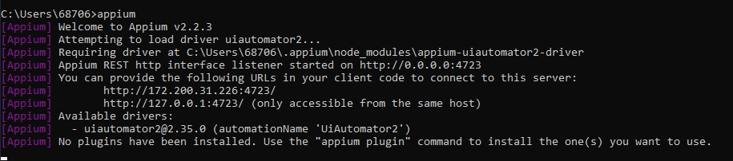
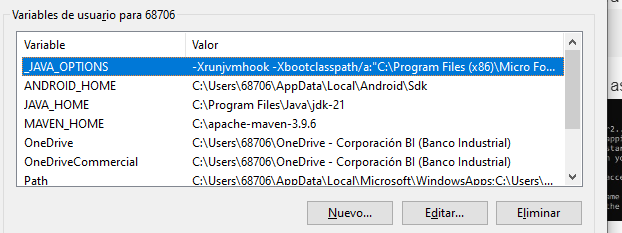
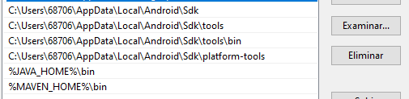
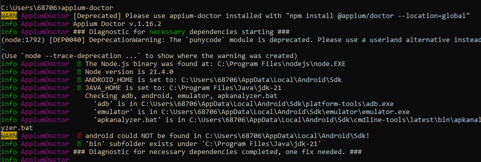

# Manual  de Instalacion

Manual para instalacion y configuracion del ambiente para la creacion de proyectos con Appium y JAVA.

##Indice
- [Herramientas necesarias](#herramientas-a-utilizar)
- [Instalacion](#instalación)


## Herramientas a utilizar 

- NodeJs
- Android Studio (Opcional) *(Recomendado)*
- Skd y Jdk de Java*
- ADB(Android Debug Bridge)**
- IDE a su eleccion (Se recomienda utilizar Visual Studio Code)
- Maven
- Appium Inspector
- Vysor (Opcional)
- Appium-Doctor

*El sdk viene incluido en Android Studio
**Android Studio incluye adb
**NOTA** Si ya cuenta con el jdk de Java se debe de actualizar


## Instalación

0. **Paso 0:** Instalar el sdk y jdk  o Instalar Android Studio, puede descargar Android Studio [aqui](https://www.googleadservices.com/pagead/aclk?sa=L&ai=DChcSEwjOy6b52cSDAxWCpFoFHYAmBq4YABABGgJ2dQ&ase=2&gclid=Cj0KCQiAy9msBhD0ARIsANbk0A_QVY1zKFcTKu1vSKDiJP2BWnWFssWsb6zFZ1nyb3AkdQfqUMFfrhkaAuOAEALw_wcB&ei=fyaXZYS2A7z8wbkPrZifkAE&ohost=www.google.com&cid=CAESVeD21B72KuZXeIS8Njmn0nT_DKh7UByTwxjiQPTQS6H7h2P83n5dV7G5TZ6jIyzsWXS7ZVhq5BDCBDjf8tzruObwR6J67U6tHiHuxoj-P1mLUHslvhQ&sig=AOD64_1cAP2Kzzmn5-6A4_ux9PaEfOXNLQ&q&sqi=2&nis=4&adurl&ved=2ahUKEwjE8aD52cSDAxU8fjABHS3MBxIQqyQoAHoECAoQCw)

1. **Paso 1:** Instalar [NodeJs](https://nodejs.org/en/download/current)
Para verificar que se haya instaldo bien puede correr la siguiente linea de comandos
    ```bash
    node --version
    ```
2. **Paso 2:** Instalacion de Appium.
Se debe ejecutar el siguiente comando para instalarlo con npm
    ```bash
    npm install -g appium
    ```

3. **Paso 3:** Instalacion de Driver de Appium
El driver facilitara la conexion de Appium con el dispositivo
    ```bash
    npm install appium-uiautomator2-driver
    ```

4. **Paso 4:** Verificacion de Instalacion de Appium
Para verificar la instalacion corra en consola el siguiente comando
    ```bash
    appium
    ```
    Deberia de mostrar en consola asi:
    
**Nota:** Para encender el cliente de appium debe de correr este comando en la consola.

5. **Paso 5:** Configurar el Variables de Entorno
    - Agregar las variables de entorno:
        - ANDROID_HOME
        - JAVA_HOME
        - MAVEN_HOME
        **Nota:** Si no tiene MAEVEN solo descargue el binario.zip [aqui](https://maven.apache.org/download.cgi) y descomprimalo y pegue la carpeta [apache-maven-3.9.6] en el disco C:/
    - Agregue y/o verifique que las variables de entorno esten de la siguiente manera.
    
    - Edite la variable Path y agregue las siguientes:
    
    **Nota:** Cambiar "68706" por su usuario en la maquina
    - Guarde los cambios, si es necesario reinicie su maquina.

6. **Paso Extra:**
    - Para verificar que se haya instalado todo y las variables esten correctas instale la siguiente herramienta desde la terminal
    ```bash
    npm install -g appium-doctor
    ```
    - Ahora ejecute el siguiente comando
    ```bash
    appium-doctor
    ```
    -  Debera de de aparecer algo asi, si algo le aparece en rojo revise los pasos anteriores.
    

___

Sigue con [Guia de Capabilities](./Talller2%20Capabilities-guide.md)


