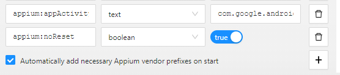
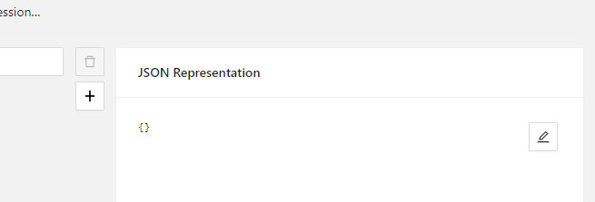
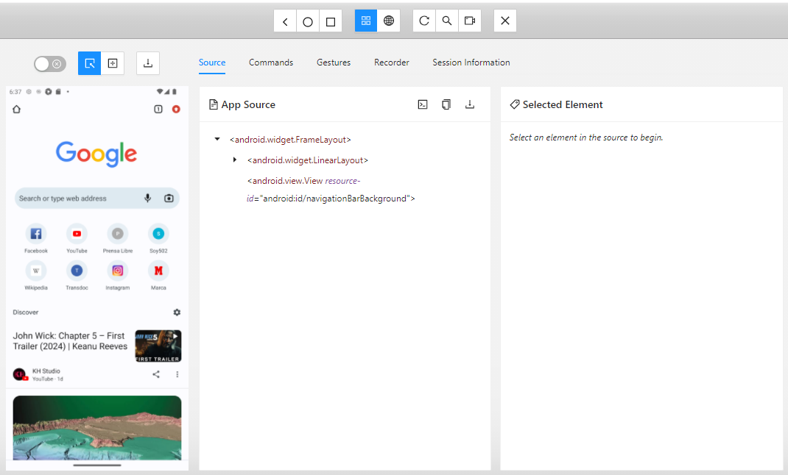

# Appium Inspector

Appium Inspector es una herramienta de automatización de pruebas para aplicaciones móviles. Permite a los desarrolladores y probadores interactuar con la interfaz de usuario de una aplicación móvil y realizar pruebas automatizadas.

## Características principales

- Inspección de elementos: Appium Inspector muestra una representación visual de la interfaz de usuario de la aplicación móvil, lo que permite a los usuarios inspeccionar y seleccionar elementos de la interfaz de usuario para realizar acciones y pruebas automatizadas.

- Grabación de acciones: Appium Inspector permite grabar las acciones realizadas en la aplicación móvil, como tocar botones, desplazarse por la pantalla y completar formularios. Estas acciones grabadas se pueden reproducir posteriormente como parte de una prueba automatizada.

- Identificación de elementos: Appium Inspector proporciona una forma sencilla de identificar elementos de la interfaz de usuario, como botones, campos de texto y elementos de lista. Los usuarios pueden utilizar diferentes estrategias de localización, como ID, nombre, clase o XPath, para identificar los elementos de forma única.

- Visualización de propiedades: Appium Inspector muestra las propiedades y atributos de los elementos de la interfaz de usuario, como el texto, el color, el tamaño y la posición. Esto facilita la comprensión de la estructura y el diseño de la aplicación móvil.

## Ventajas de usar Appium Inspector

- Ahorro de tiempo: Simplifica el proceso de creación y ejecución de pruebas automatizadas al proporcionar una interfaz gráfica intuitiva y herramientas de inspección visual.

- Facilidad de uso: No requiere conocimientos avanzados de programación. Los usuarios pueden interactuar con la aplicación móvil y crear pruebas automatizadas utilizando una interfaz gráfica fácil de entender.

- Compatibilidad multiplataforma: Es compatible con aplicaciones móviles desarrolladas para iOS y Android, lo que permite realizar pruebas automatizadas en diferentes dispositivos y sistemas operativos.

¡Empieza a utilizar Appium Inspector para automatizar tus pruebas de aplicaciones móviles y mejorar la calidad de tus desarrollos!
___
## Primeros Pasos
Abre la herramienta, si no la tienes instalada recuerda que puedes descargar haciendo [click aqui](https://github.com/appium/appium-inspector/releases)

Para agregar las capabilities necesarias puedes hacerlo de dos formas:

1. Agregando una por una en esta seccion <br>


2. Agregando un Json en esta seccion 


Puede dejar activado este check para evitar problemas de conexion <br>


Bien a modo de ejemplo puede copiar la siguiente estructura json:

```json
{
  "appium:deviceName": "emulator-5554",
  "appium:udid": "emulator-5554",
  "platformName": "Android",
  "appium:platformVersion": "13",
  "appium:automationName": "UiAutomator2",
  "appium:appPackage": "com.android.chrome",
  "appium:appActivity": "com.google.android.apps.chrome.Main",
  "appium:noReset": true
}
```
**Repaso de Capabilities**
- `deviceName`: El nombre del dispositivo o emulador, Este lo puede ver desde el dispositivo.
- `udid`: El identificador único del dispositivo, para obtener el udid del dispositivo puede ejecutar el siguiente comando en consola:
```bash
adb devices
```
Tendra una salida similar a la siguiente:
```
List of devices attached
emulator-5554   device
```
- `platformName`: El nombre de la plataforma móvil (por ejemplo, Android, iOS).
- `platformVersion`: La versión de la plataforma móvil, en este caso es Android 13
- `automationName`: El nombre de la tecnología de automatización a utilizar (por ejemplo, UiAutomator2, XCUITest).
- `appPackage`: Especifica el nombre del paquete de la aplicación que se va a automatizar en un dispositivo Android.
- `appActivity`: se utiliza para especificar la actividad principal de la aplicación que se va a automatizar en un dispositivo Android. Una actividad en Android es una pantalla o una interfaz de usuario con la que el usuario interactúa. Cada aplicación tiene al menos una actividad principal que se inicia cuando se abre la aplicación (Si quiere validar las actividades de puede descargar una aplicacion llamada [Apk info](https://play.google.com/store/apps/details?id=com.wt.apkinfo&hl=es&gl=US&pli=1))
- `noReset`: Sirve para controlar si se debe restablecer el estado de la aplicación antes de cada ejecución de la prueba.

¡Listo ya tienes tus capabilities! Ahora solo tienes que darle click en Start Session


> **Nota:** Antes de utilizar Appium Inspector, asegúrate de haber inicializado el servidor de Appium para establecer la conexión con tu dispositivo móvil. Sin la conexión al servidor de Appium, no podrás realizar pruebas automatizadas.
---
¡Genial! ya puedes inspeccionar elementos
