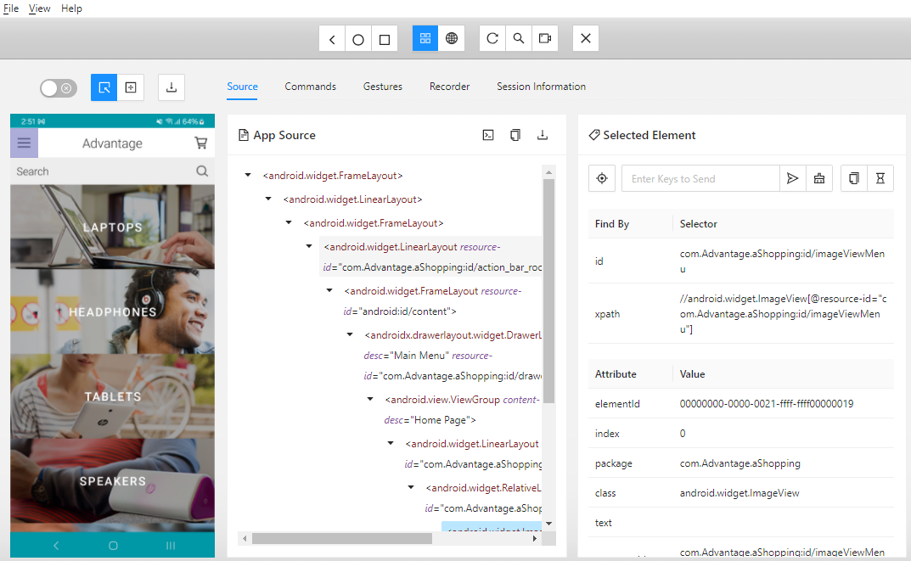
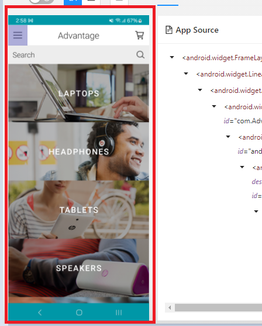
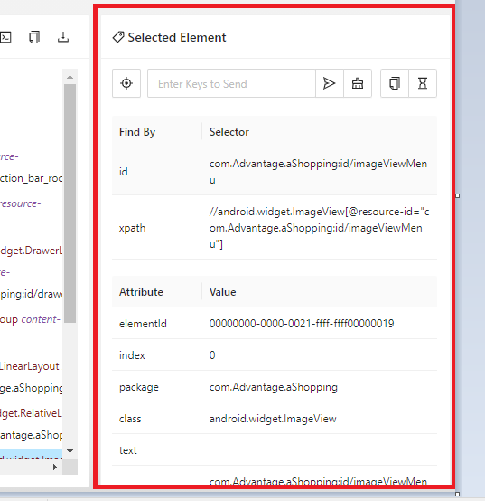
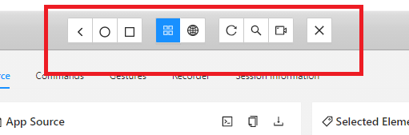

# Inspeccionando Objetos
¡Bien! Ya tenemos nuestro dispositivo listo para inspeccionar.

Ya que el dispositivo esta esta conectado y se inicio la conexion con Appium Inspector podemos explorar.

Es preciso recordar que `Appium` Funciona como una api que esta constantemente esperando peticiones de un cliente, en nuestro caso `Appium Inspector` es el cliente. 

#### Elementos principales

 
_En esta parte puede explorar lo que esta en pantalla y para acceder a las propiedades de algun elemento solo basta con darle click sobre el elemento deseado y se desplegara un listado con las propiedades del elemento de la siguiente manera._

_👆 Aqui es donde podemos obtener las propiedades para identificar los elementos especificos ya sea por Id, class o en ultimo caso por xpath._
___

#### Otros Elementos

_Estos elementos nos permiten la navegacion desde este cliente, tambien si se necesita refrescar la pantalla que se ve dentro del cliente, tambien el buscador de elementos, grabacion y por ultimo el cierre de la sesion con el servidor de Appium._

Ahora Realizaremos [nuestro primer ejemplo](./Taller5%20Mi%20primer%20Test%20con%20Appium.md).
