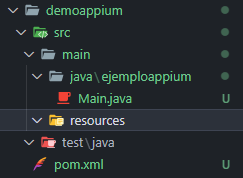
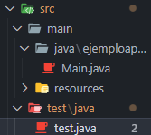
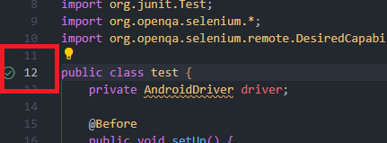
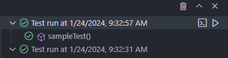
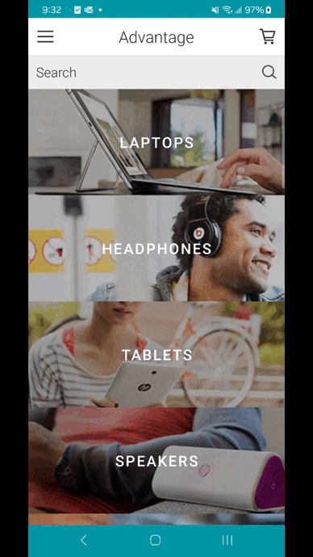

# Mi primer Test con Appium
Crearemos un pequeño ejemplo, utilizaremos como lenguaje de programacion Java y como editor de codigo Visual Studio Code. El codigo de este ejemplo esta disponible en la carpeta `demoappium` de este mismo repositorio.

### Paso 1: Creacion de proyecto en VSCode
Crea un proyecto con Maven en 0, Te recomendamos utilizar la `Extension Pack for Java` como extension para manejar Java en vscode
>**Recuerda** que debes tener descargada y configuradas las Variables de entorno de maven 


Una vez creado el proyecto deberia de tener una estructura de la siguiente forma:


### Paso 3: Añade las dependencias
Localiza en tu directorio el archivo `pom.xml`, copia y pega las siguientes dependencias, puedes guiarte con el archivo [pom.xml](url) de este repositorio.

```xml
    <dependencies>
        <dependency>
            <groupId>io.appium</groupId>
            <artifactId>java-client</artifactId>
            <version>8.3.0</version>
        </dependency>
        <dependency>
            <groupId>org.seleniumhq.selenium</groupId>
            <artifactId>selenium-java</artifactId>
            <version>4.13.0</version>
            <scope>compile</scope>
        </dependency>
        <dependency>
            <groupId>org.testng</groupId>
            <artifactId>testng</artifactId>
            <version>7.4.0</version>
            <scope>test</scope>
        </dependency>
    </dependencies>
```
### Paso 4: Crea una clase test.java en el directorio de test
 

 ### Paso 5: Importa las librerias necesarias
 _Para este ejemplo utilizaremos estas librerias._
 ```java
 import io.appium.java_client.android.AndroidDriver;

import java.net.MalformedURLException;
import java.net.URL;
import org.junit.After;
import org.junit.Before;
import org.junit.Test;
import org.openqa.selenium.*;
import org.openqa.selenium.remote.DesiredCapabilities;
 ```

### Paso 6: Define la estructura de la clase test
 _La estructura basica de nuestra clase sera la siguiente:_
 ```java
 
public class test {
    private AndroidDriver driver;

    @Before
    public void setUp() {
        DesiredCapabilities cap = new DesiredCapabilities();
        // define tus capabilities en este punto
        URL url = getUrl();

        driver = new AndroidDriver(url, cap);
    }

    private URL getUrl() {
        try {
            return new URL("http://127.0.0.1:4723");
        } catch (MalformedURLException e) {
            e.printStackTrace();
            return null; // or handle the exception accordingly
        }
    }

    @Test
    public void sampleTest() {
        // Write your test here
    }

    @After
    public void tearDown() {
        driver.quit();
    }
}

 ```
 ### Paso 7: Agregar las capabilities al codigo
 _Ya vimos lo que son las capabilities, es hora de agregarlas al codigo por lo que las agregaremos de la siguiente manera:_
 ```java
DesiredCapabilities cap = new DesiredCapabilities();
cap.setCapability("appium:deviceName", "Galaxy A34 G");
cap.setCapability("appium:udid", "RFCW4273XKK");
cap.setCapability("platformName", "Android");
cap.setCapability("appium:platformVersion", "14");
cap.setCapability("appium:appPackage", "com.Advantage.aShopping");
cap.setCapability("appium:appActivity", "com.Advantage.aShopping.SplashActivity");
cap.setCapability("appium:automationName", "UiAutomator2");
cap.setCapability("appium:noReset", true);
cap.setCapability("appium:ensureWebviewsHavePages", true);
cap.setCapability("appium:nativeWebScreenshot", true);
cap.setCapability("appium:newCommandTimeout", 3600);
cap.setCapability("appium:connectHardwareKeyboard", true);
 ```
_Si te puedes dar cuenta son las mismas capabilities que vimos en la [leccion anterior](./Taller4%20Inspeccionando%20Objetos.md)_

### Paso 8: Agregar acciones
_Es hora de agregar nuestras acciones para nuestro test, en esta parte utilizaremos los identificiadores obtendios por Appium Inspector para realizar ciertas acciones, esto hazlo en la funcion de `SampleTest`_
```java
 // Write your test here
// EJEMPLO DE UNA BUSQUEDA EN LA APLICACION Advantage Shopping
// PASO 1: Hacer click en el boton de busqueda
driver.findElement(By.id("com.Advantage.aShopping:id/editTextSearch")).sendKeys("Phones");
// PASO 2: Hacer click en el boton de busqueda
driver.findElement(By.id("com.Advantage.aShopping:id/imageViewSearch")).click();
// PASO 3: Hacer click en el Beats studio 2 over-ear
driver.findElement(By.xpath(
        "//android.widget.TextView[@resource-id=\"com.Advantage.aShopping:id/textViewProductName\" and @text=\"BEATS STUDIO 2 OVER-EAR MATTE BLACK HEADPHONES\"]"))
        .click();
// PASO 4: Hacer click en el boton de agregar al carrito
driver.findElement(By.id("com.Advantage.aShopping:id/buttonProductAddToCart")).click();
```
### Paso 9: Iniciar las pruebas
_Bien ya tenemos nuestro ejemplo de test listo es hora de ejecutarlo_
_En este caso se utiliza Visual Studio Code y nos da la facilidad de correr las pruebas accionando el boton verde que aparece al lado izquierdo de la funcion/clase de la siguiente manera:_

_Al ejecutarse veras en la parte inferior de `TestResults` la si se ejecuta de manera correcta el test o si hubo algun fallo_


_Mientras se hace el test podras visualizar algo como esto en tu dispositivo_


>**NOTA:** Recuerda tener el servidor de appium ejecutandose 

 
